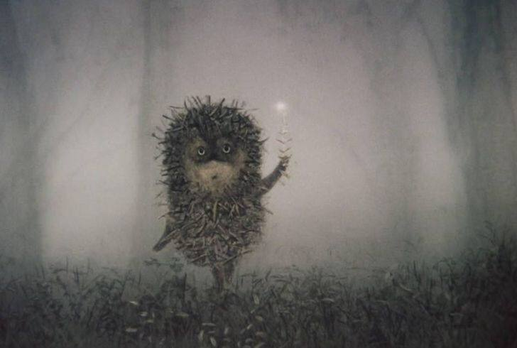

## Group Tiled Attention for In-Context RL

This is my implementation of [Group Tiled attention](https://github.com/Dao-AILab/grouped-latent-attention) (GTA) on the basis of [Algorithm Distillation](https://arxiv.org/abs/2210.14215) (AD) for In-Context RL capabilites on the example of toy DarkRoom environment.
<br>

Codebase shares similar philosophy of [xland100b](https://github.com/dunnolab/xland-minigrid-datasets) and [cleanrl](https://github.com/vwxyzjn/cleanrl), i.e. isolates methods GTA- and MHA-based transformers so they can be self-contained and easily integrated into other projects.

<br>
Modifications (compared with the original repo):

- custom RoPE to preserve memory during backward pass
- optional qk norm
- no copying when broadcasting `key_rope` in forward pass and kv cache
- dropout inside attention mechanism
- attention maps visualization (just for my own interest)

<br>
Miscellaneous moments from attention maps:

- GTA tries to replicate vanilla maps structure (including sinks and sparse nature)
- that becomes more sparse with increasing rewards in a sequence (more in `assets`)
- though it is more prone to vanishing and [over-mixing](https://arxiv.org/abs/2504.02732)


## Requirements to reproduce
- `requirements.txt`
- CUDA 12.6
- python 3.10+
<br>
```
export WANDB_ENTITY=""
export WANDB_BASE_URL="https://api.wandb.ai"
export WANDB_API_KEY=""

bash run.sh
```

see `run.sh` for more details about training params.
<br>

I would appreciate comments on mistakes and bugs :)
<br>

